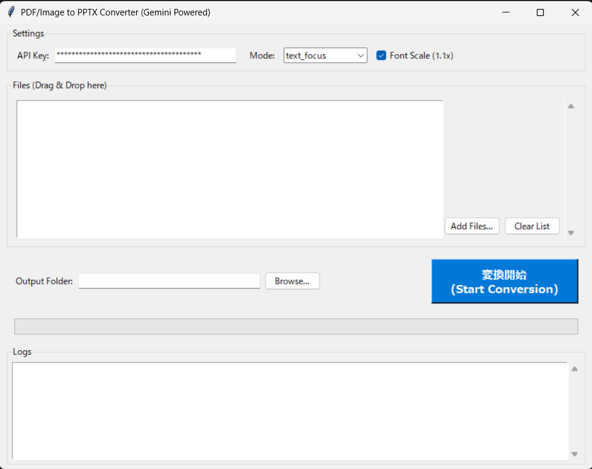

# PDF2PPTX Converter
Google Gemini APIを活用して、PDFファイルや画像ファイルを編集可能なPowerPoint (.pptx) ファイルに変換するツールです。
レイアウト解析にAIを使用することで、これまで難しかった「元のレイアウトを保ったままのテキスト化」を高精度に実現します。




## 主な機能

*   **高精度なレイアウト復元**: Gemini 3.0 Flash (またはその他のGeminiモデル) を使用し、テキストブロックと画像領域を識別してスライド上に再配置します。
*   **テキスト編集可能**: OCR結果をテキストボックスとして配置するため、変換後にPowerPoint上で自由に編集できます。
*   **画像/図表の保持**: テキスト以外の図や写真は画像としてスライドに配置されます。
*   **選べる3つのモード**:
    *   `Standard`: テキストと画像を個別に配置する標準モード。
    *   `Text Focus`: 背景を画像として敷き、その上に透明なテキストボックスを配置する、見た目の再現性を重視したモード。
    *   `Figure Focus`: Text Focusに加え、図形領域を切り出し・透過処理してオブジェクトとして配置するモード。
*   **簡単操作**: ドラッグ＆ドロップ対応のGUIアプリが付属しています。

## 必要な環境

*   Python 3.10 以上推奨
*   Google Gemini API Key

## インストール手順

1.  リポジトリをクローンまたはダウンロードします。
2.  必要なライブラリをインストールします。

```bash
pip install -r requirements.txt
```

3.  環境変数を設定します。
    - プロジェクトルートに `.env.example` があるので、それをコピーして `.env` という名前に変更します。
    - `.env` ファイル内の `GOOGLE_API_KEY` にご自身のGemini APIキーを記述してください。

```text
GOOGLE_API_KEY=your_api_key_here
```

## 使い方

### GUIアプリを使用する場合 (推奨)

以下のコマンドでGUIアプリを起動します。

```bash
python gui_app.py
```

1.  **API Key設定**: 初回起動時はSettingsエリアにAPI Explorer等で取得したAPIキーを入力し「Save」を押してください。
2.  **ファイル追加**: 変換したいPDFや画像を画面中央のリストにドラッグ＆ドロップします。
3.  **変換開始**: 「Start Conversion」ボタンを押すと変換が始まります。

### コマンドライン (CLI) を使用する場合

バッチ処理などを行いたい場合は、コマンドラインから直接実行することも可能です。

```bash
python pdf2pptx.py input.pdf output.pptx --api_key "YOUR_API_KEY"
```

オプション:
*   `--mode`: `standard`, `text_focus`, `figure_focus` のいずれかを指定 (デフォルト: standard)
*   `--font_scale`: フォントサイズの拡大縮小率 (デフォルト: 1.1)

## ドキュメント

詳細な仕様や操作マニュアルについては `docs` フォルダをご確認ください。

*   [ユーザーマニュアル (docs/user_manual_v1.0.md)](docs/user_manual_v1.0.md)
*   [システム仕様書 (docs/system_specification_v1.0.md)](docs/system_specification_v1.0.md)

## ライセンス

MIT License (または適切なライセンスをここに記載)
